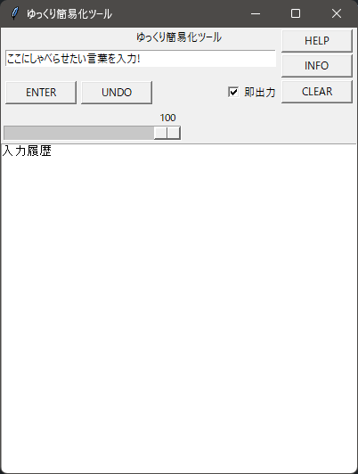

# ゆっくり簡易化ツール
## ゆっくり簡易化ツールについて
ゆっくり簡易化ツールは棒読みちゃんを少し簡単にし、少し機能を追加したソフトウェアです。  


## 使用用途
* ゲームなどのボイスチャット
* ゆっくりの声のテスト  
など

## 使い方
### 起動方法
ゆっくり簡易化ツールを起動するには棒読みちゃんを起動してからゆっくり簡易化ツールを起動してください。  
### 入力欄の使い方
入力欄にゆっくりにしゃべらせたい言葉を入力して``ENTERボタン``を押すまたは、エンターキーを押してください。  
### UNDOボタンの使い方
UNDOボタンは1つ前に入力した内容に戻ります。
### 即出力モードの使い方
即出力モードは即出力にチェックを入れると使えます  
即出力モードは入力欄にしゃべらせたい言葉を書いてエンターキーを押すと、すぐにゆっくりがしゃべってくれます。
### @で出力モードの使い方
@で出力モードは即出力のチェックボックスを空白にすると使えます  
入力した内容は一時的に保存されます。
@キーを入力すると一時的に保存されていた内容が出力されます。
### CLEARボタンの説明
CLEARボタンは入力履歴を初期化します。  


## インストール方法
### 事前にインストールしておくもの
python 3.10.9  
### コマンドライン
```bash
git clone https://github.com/akazdayo/YUKKURIKANIKATOOL.git
pip install pipenv
pipenv install
pipenv shell
```
## 参考にさせていただいたサイト
https://qiita.com/lt900ed/items/a5b44e4c27def192d323

## 過去のバージョンについて
過去のバージョンはGithubのReleaseに残すことにします。  
過去のバージョンをインストールしたい場合は、Releaseからお願いします。

### 過去のREADME
[Version β7](./README-v7.md)